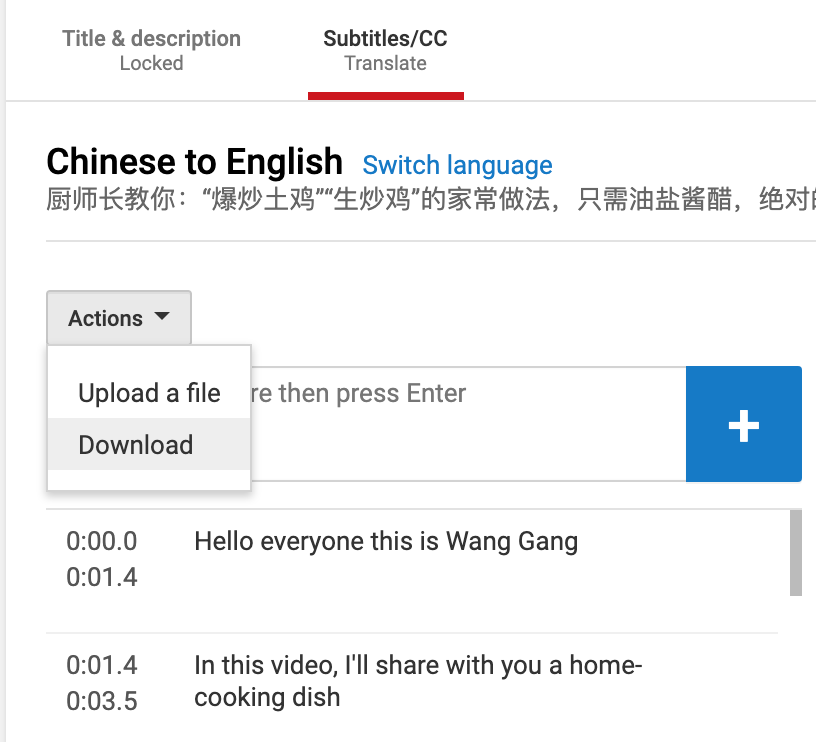

# 制作字幕文件

## 制作步骤

1. 使用 YouTube 的字幕添加功能制作英文字幕。可参考[官方帮助](https://support.google.com/youtube/answer/6054623)或[视频教程](https://youtu.be/_3MMKHqoZrs)
2. 英文字幕制作好后，下载字幕文件，如下图所示 

**注意：请务必不要在此时点`提交`/`Submit`。须在审核完毕后，上传审核后的版本方可提交。**

## 附注

如果觉得制作字幕文件麻烦，可以简单制作一份不带时间轴的中英对照翻译稿（[范例](/subtitles/wang-gang/20190825-ma-feng-wo)）。然而不推荐此法，因为定稿后依然需要在 YouTube 花时间添加时间轴，总体而言工作量并没有减少，反而流程更为琐碎。
