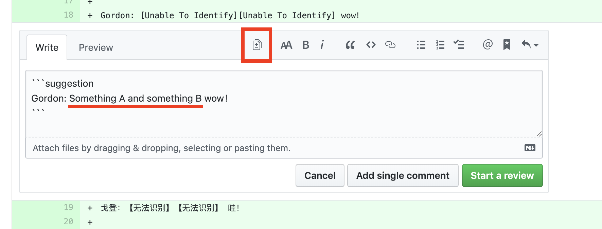

# 如何添加审核评论

参考阅读 [GitHub 官方版教程](https://help.github.com/en/articles/reviewing-proposed-changes-in-a-pull-request)。

## 简易审核步骤

1. 所有待审核的翻译稿都在 [**Pull requests**](/../../pulls) 标签页下，如下图

2. 点击相应的 pull request 开始审核
3. 翻译稿内容在 **Files changed** 标签页下，如下图

4. 将鼠标移至想要评论的行，点击蓝色 "**+**" 发表审核意见，如下图

5. 可以在此写审核想法，但更推荐直接写更明确的修改意见。方法是点击 **insert a suggestion** 按钮（如下图），然后修改评论内容

6. 添加完修改意见后按 **Start a review** 按钮，如下图

7. 对每行需要修改的内容重复上述 4 至 6 步

8. 审核完毕后，点击 **Finish your review** 按钮，然后点击 **Submit review** 从而发布审核意见
  a. 发布时建议选择 **Approve** 方便进行翻译的同学进行后续的工作（除非翻译质量实在太差、出现太多的缺漏等等）

