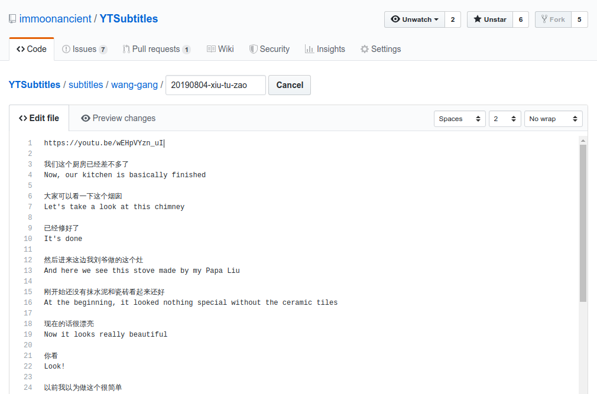
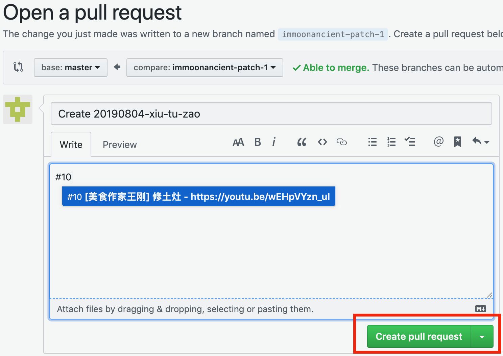

# 如何上传待审核的翻译稿

待审核的翻译稿以 [pull request](https://help.github.com/en/articles/about-pull-requests) 的形式上传。

如果你已经是 collaborator，请参考 [collaborator 版教程](upload.md)。

## 上传步骤（简易版）

1. 进入相应频道的文件夹，如 美食作家王刚 对应的文件夹为 [subtitles/wang-gang](https://github.com/immoonancient/YTSubtitles/tree/master/subtitles/wang-gang)
2. 点击 **Create new file** 按钮，如下图

3. 输入文件名并添加翻译稿内容，如下图。注意由于 github 自身原因，文件名请勿包含中文

4. 在页面底部点击绿色的 **propose new file** 按钮

5. 进入 **Comparing changes** 页面后，点击绿色的 **Create pull request** 按钮，如下图

6. 进入 **Open a pull request** 页面后，输入标题及描述内容，比如视频标题，issue 编号以及想要请审核者注意的问题等等。然后点击绿色的 **Create pull request** 按钮，如下图

一个新鲜的 pull request 就上传完成。
