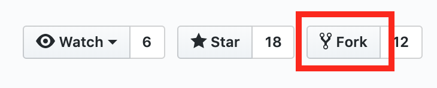
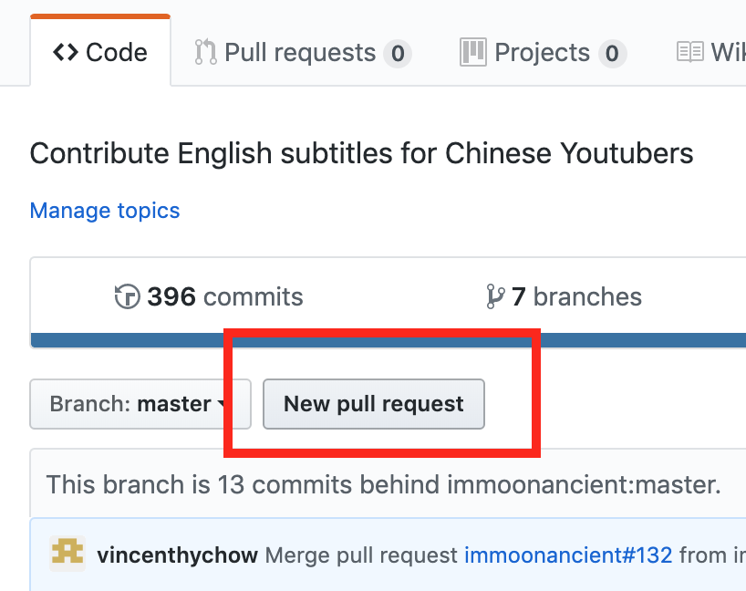

# 如何以 pull request 形式上传字幕文件

注 1：本教程为仅适用于本字幕组的简易教程。
完整的 pull request 相关知识请参考 [GitHub 官方帮助](https://help.github.com/en/articles/about-pull-requests)。

注 2：本教程适用于一般参与者。如果你已经是 Collaborator，可以使用[更简化的步骤(TODO)](upload-subtitle-pr-with-write-access.md)。

## 前置工作

- 如果你是第一次投稿，投稿前需要建立自己的 fork，建立方式为点击 `fork` 按钮，如下图 
  

- 如果你以前参与过且已经建立过 fork 了，则需要更新自己的 fork：
   - 简易方法：[删除自己的 fork](https://help.github.com/en/articles/deleting-a-repository) 然后重新建立一次。
     注意：这样会删除自己所有未整合的工作，删除前请保存
   - 完整方法：如果不愿意删除，那么更新过程可能会比较麻烦。可以参考[这篇文章](https://erikaybar.name/git-updating-an-outdated-github-fork)。

## 上传步骤

1. 进入你自己的 fork
   - 确定当前网页地址为 `https://github.com/{你的用户名}/YTSubtitles/`
   - 如果是刚刚才新建的 fork，那么你现在应该已经在这一页了
2. 进入相应的文件夹，如 `美食作家王刚` 的文件夹为 `subtitles/wang-gang`
3. 点击 `Upload files` 按钮上传字幕文件，并点击页面底部绿色的 `Commit changes` 按钮确认上传
   - 注意此时该文件只是你的个人文件，尚未整合进本字幕组
4. 上传完毕后，点击 `New pull request` 按钮（见下图），然后再次点击 `Create pull request` 即可开始创建 pull request 
   
5. 最后填写 pull request 标题和描述信息之后再次点击 `Create pull request` 按钮即可

到这里，一份待审核的字幕稿就提交完成。
