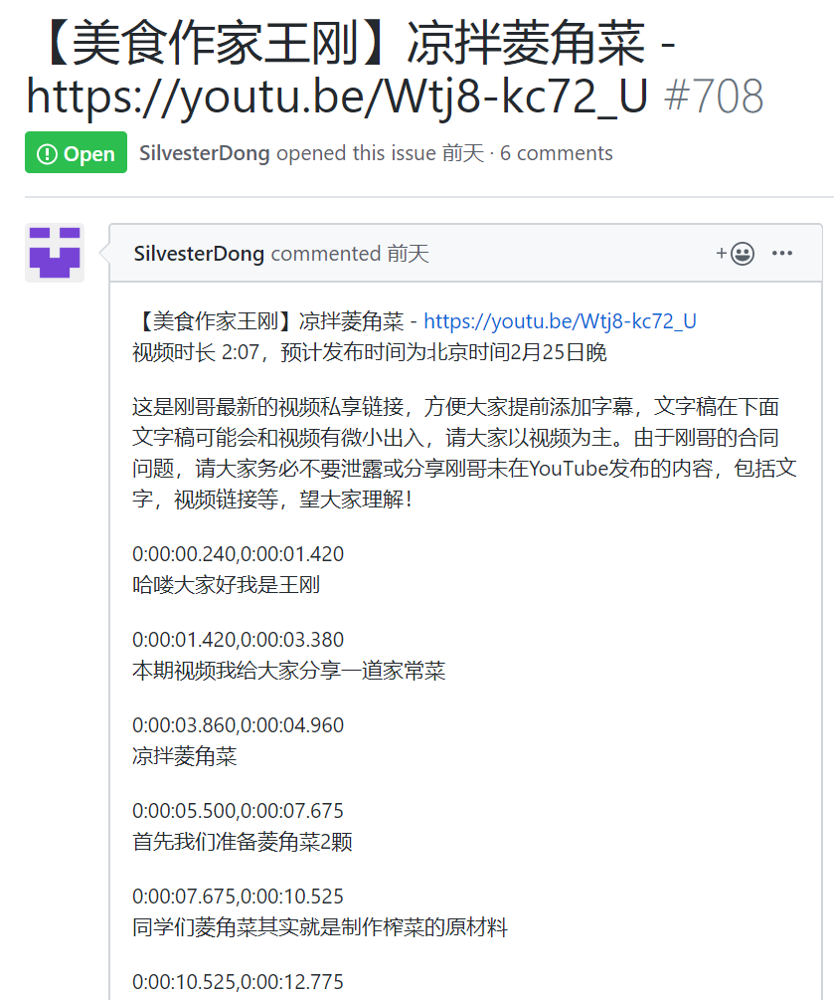
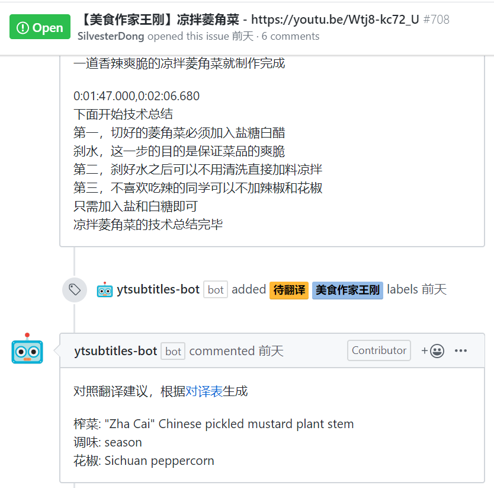
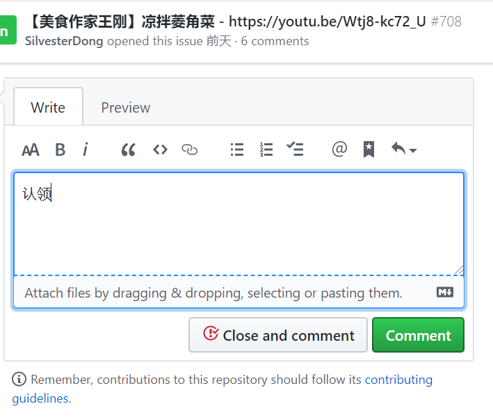
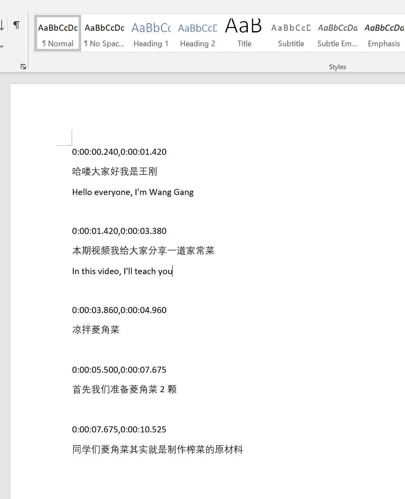
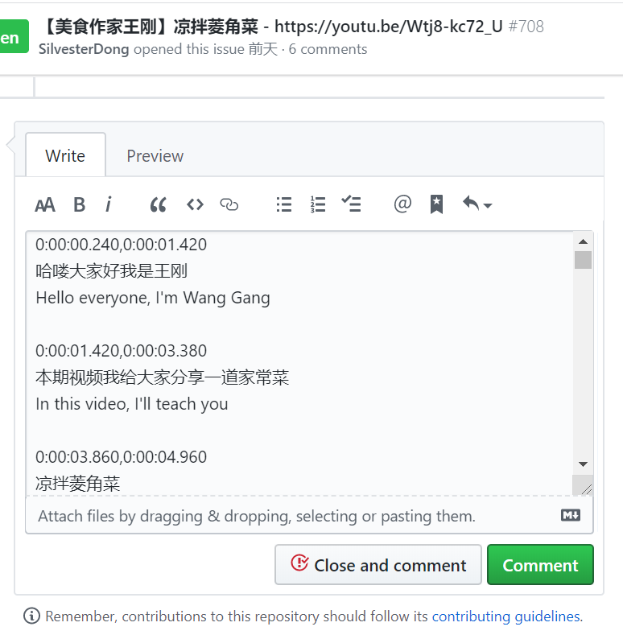
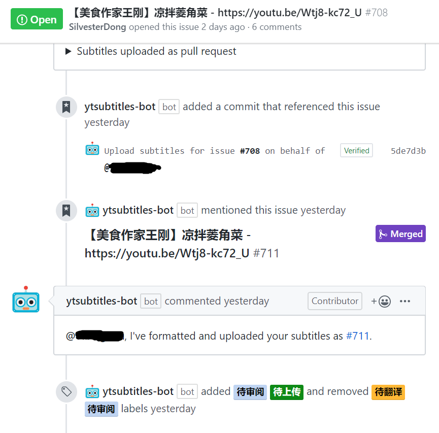

# 字幕翻译及投稿

通常情况下，合作频道会提供要翻译的段落以及带有时间轴的官方中文字幕。因此一般情况下，组员只需要负责翻译即可。

如果想为其他视频从零开始制作字幕，请[发 issue ](https://github.com/immoonancient/YTSubtitles/issues/new)联系我们。

# 步骤

0. 找到视频对应的 issue ，其中应当有官方中文字幕等需要翻译的内容。

- Issue 内通常也会有一些 bot 提供的翻译提示，能够对翻译有所帮助。

1. **认领**：在 issue 里回复“认领”。这样你会正式成为这期字幕的 assignee。

2. **翻译**：将官方中文复制到 Word / Google Docs / 记事板之类的编辑器里开始翻译。在每行中文的下方添加对应的英文翻译即可。

3. **交稿**：翻译完后，将整个文件全选复制，然后粘贴到 issue 内并回复。注意：
   - 提交的是文件内容，不是文件本身。不要把整个 docx 文件作为附件提交上来
   - 只有 assignee 有权限以此方法交稿

   
4. **等待审核**：此时 bot 会将你的稿件打包成一个 pull request 供组内审核，并会回复 pull request 的链接。后续的审稿、修改操作会在这里面完成。

5. （可选）**定稿**：组内审核完毕后，前往 pull request 内看看对于审核意见是否有进一步的反馈意见，比如是否采纳建议的各种修改等等。达成一致后即可定稿。
   - 注：特殊情况下（例如时间紧迫）可省略反馈步骤，直接采纳全部意见定稿。
